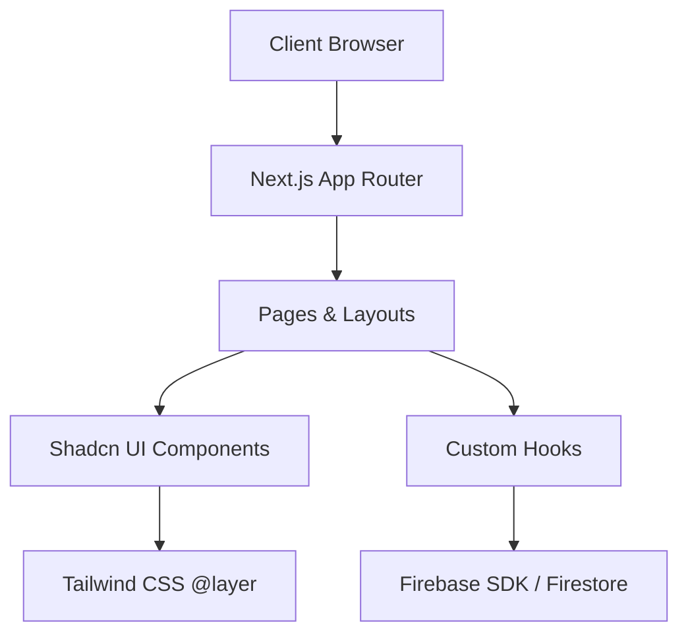

# 💰 FinalyzeIT - Premium Personal Finance Tracker


**FinalyzeIT** is a state-of-the-art, frontend-focused personal finance tracking solution designed to empower users with full control over their financial health. Built with **Next.js 14**, **Firebase**, and **Tailwind CSS**, it combines high-performance architecture with a breathtaking user interface.

---

## 📸 Visual Gallery

<div align="center">
  <table border="0">
    <tr>
      <td></td>
      <td></td>
    </tr>
    <tr>
      <td></td>
      <td></td>
    </tr>
     <tr>
      <td></td>
      <td></td>
    </tr>
  </table>
</div>

---

## 🚀 Key Features

-   **🔐 Secure Authentication**: Integrated Firebase Authentication for robust user sign-ups and logins.
-   **📊 Dynamic Dashboard**: Real-time overview of income, expenses, and overall balance with interactive charts powered by **Recharts**.
-   **📅 Precise Budgeting**: Set and monitor monthly budgets across multiple categories with visual progress tracking.
-   **🎯 Goal Management**: Define financial milestones and track your journey toward achieving them.
-   **💸 Transaction Ledger**: Detailed history of all financial activities with filtering and management capabilities.
-   **⚡ Fluid Interactions**: Silky smooth transitions and micro-animations implemented via **Framer Motion**.
-   **📱 Edge-to-Edge Responsive**: A mobile-first design philosophy ensures a seamless experience across all devices.

---

## 🛠️ Tech Stack

### Frontend
-   **Framework**: [Next.js 14](https://nextjs.org/) (App Router)
-   **Styling**: [Tailwind CSS](https://tailwindcss.com/) & [Radix UI](https://www.radix-ui.com/) (Shadcn/UI components)
-   **Animations**: [Framer Motion](https://www.framer.com/motion/)
-   **Charts**: [Recharts](https://recharts.org/)
-   **Forms**: [React Hook Form](https://react-hook-form.com/) & [Zod](https://zod.dev/) (Validation)
-   **Icons**: [Lucide React](https://lucide.dev/)

### Backend & Services
-   **Database/Auth**: [Firebase](https://firebase.google.com/) (Firestore & Auth)
## 🏗️ System Architecture

FinalyzeIT is built on a **Modular Next.js 14 Architecture**, utilizing the App Router for clean separation of concerns and Shadcn UI for a consistent, premium design system.



### 📂 Project Structure
```text
finance_tracker/
├── app/                  # Next.js App Router
│   ├── (main)/           # Core application pages
│   │   ├── about/        # Product information
│   │   ├── blog/         # Financial articles & tips
│   │   ├── budget/       # Budget planning & limits
│   │   ├── contact/      # Support & Inquiry
│   │   ├── dashboard/    # Main financial HQ
│   │   ├── goals/        # Saving targets tracking
│   │   ├── reports/      # Data analysis & charts
│   │   └── transactions/ # Ledger & history
│   ├── login/ / register/ # Authentication flow
│   ├── globals.css       # Global design tokens
│   ├── layout.tsx        # Root shell & Providers
│   └── page.tsx          # Landing / Entry point
├── components/           # UI Layer
│   ├── ui/               # Shadcn primitive components
│   └── theme-provider.ts # Dark/Light mode logic
├── hooks/                # Specialized logic
│   ├── use-mobile.tsx    # Responsive state management
│   └── use-toast.ts      # UI feedback system
├── lib/                  # Core Utilities
│   ├── firebase.ts       # Backend configuration
│   └── utils.ts          # Tailwind merge & cn helpers
├── public/               # Static assets & brand assets
└── tailwind.config.ts    # Deep design system customization
```

---

## 💎 Featured Modules

-   **Dashboard**: A bird's eye view of your financial status with real-time balance updates.
-   **Budget Tracker**: Intelligent categorization to ensure you stay within your limits.
-   **Goal Engine**: Visual progress for long-term financial milestones.
-   **Reports Center**: Detailed analytics to identify spending patterns.
-   **Secure Auth**: Bulletproof login/registration powered by Firebase.

---

## 🛠️ Tech Stack & Tooling

### Core
-   **Next.js 14**: Server-side rendering & optimized routing.
-   **TypeScript**: Type-safety across the entire financial logic.
-   **Tailwind CSS**: Utility-first styling for rapid, consistent UI.

### UI & UX
-   **Shadcn UI**: Accessible, high-quality component primitives.
-   **Lucide**: Crisp, consistent iconography.
-   **Next Themes**: Seamless Dark/Light mode transition.
-   **Sonner**: Toast notifications for user feedback.

### Backend
-   **Firebase Firestore**: Real-time NoSQL database for financial records.
-   **Firebase Auth**: OAuth and Email/Password security.

---

## ⚙️ Setup & Installation

### 1. Clone & Install
```bash
git clone https://github.com/your-username/finalyzeit.git
cd finalyzeit
npm install
```

### 2. Configure Firebase
Create a `.env.local` file in the root directory and add your Firebase credentials:
```env
NEXT_PUBLIC_FIREBASE_API_KEY="YOUR_API_KEY"
NEXT_PUBLIC_FIREBASE_AUTH_DOMAIN="YOUR_DOMAIN"
NEXT_PUBLIC_FIREBASE_PROJECT_ID="YOUR_PROJECT_ID"
NEXT_PUBLIC_FIREBASE_STORAGE_BUCKET="YOUR_BUCKET"
NEXT_PUBLIC_FIREBASE_MESSAGING_SENDER_ID="YOUR_SENDER_ID"
NEXT_PUBLIC_FIREBASE_APP_ID="YOUR_APP_ID"
```

### 3. Launch Development Server
```bash
npm run dev
```
Open [http://localhost:3000](http://localhost:3000) to see the magic.

---

## 🎨 Design Philosophy
The UI is inspired by **Minimalist Fintech Trends**, utilizing:
-   **Glassmorphism**: Subtle translucent layers for depth.
-   **Dynamic Theming**: Support for eye-pleasing dark/light modes.
-   **Micro-interactions**: Feedback on every click and hover for a "premium" feel.

---

## 🎯 Future Roadmap
-   [ ] AI-Powered Spending Insights
-   [ ] Multi-currency Support
-   [ ] Export Reports to PDF/CSV
-   [ ] Recurring Subscription Tracking

---

Built for better financial futures.
